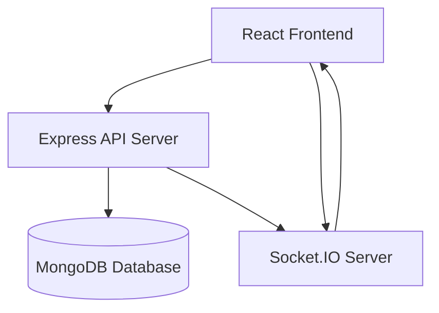
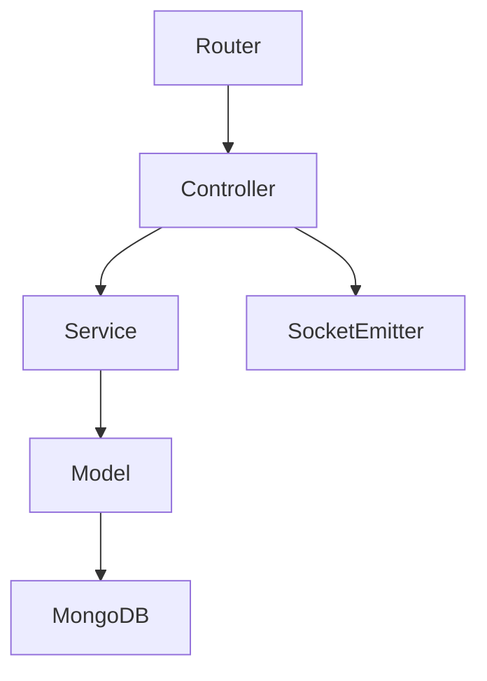
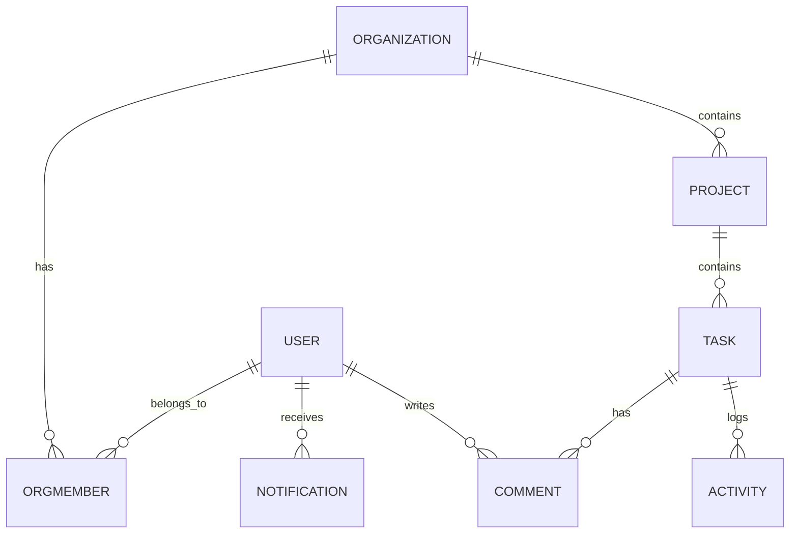
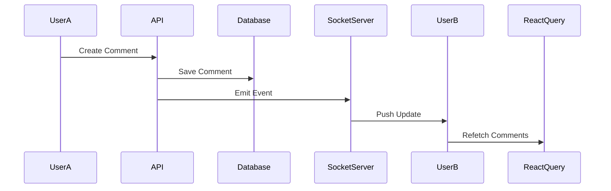

# 🚀 NexTask – Real-Time Team Collaboration SaaS

> A modern **multi-tenant project and task management platform** built with the **MERN stack + TypeScript + Socket.IO**, enabling teams to collaborate in real time with live task updates, comments, activity feeds, and notifications.

---

# 🌐 Live Concept

NexTask is designed as a **modern SaaS collaboration platform** where multiple organizations can manage their projects, tasks, members, and activities with real-time synchronization.

It demonstrates **production-level architecture** including:

* Multi-tenant SaaS design
* Real-time collaboration
* Role-based access control
* Activity tracking
* Notification system
* Scalable backend architecture

---

# 📸 Application Overview

## Dashboard

* Organization selection
* Project overview
* Activity feed
* Notifications

## Kanban Task Board

* Backlog
* In Progress
* Review
* Done

## Task Modal

* Edit task
* Comment in real time
* Change priority/status
* Assign members

## Notification System

* Realtime bell updates
* Task assignment alerts
* Comment notifications

---

# 🧠 Key Features

## 🔐 Authentication & Security

* JWT based authentication
* Secure API middleware
* Organization level access control
* Multi-tenant isolation

---

## 🏢 Multi-Tenant Organizations

Users can belong to multiple organizations.

Each organization has roles:

| Role       | Permissions               |
| ---------- | ------------------------- |
| **OWNER**  | Full control              |
| **ADMIN**  | Manage members & projects |
| **MEMBER** | Manage tasks              |

---

## 📋 Project & Task Management

* Create projects inside organizations
* Kanban style task board
* Drag & drop task status updates
* Task priority levels
* Task assignment
* Due dates

---

## 💬 Real-Time Comments

Tasks support threaded discussions.

Features:

* Live comment updates
* Multi-user collaboration
* Author metadata
* Timestamp tracking

---

## 🔔 Notification System

Users receive notifications when:

* Assigned to a task
* Someone comments on a task
* Team activity occurs

Notifications update **instantly using WebSockets**.

---

## 📈 Activity Feed

Tracks organization activity such as:

* Task creation
* Task updates
* Task assignment
* Comments

Helps teams understand **who did what and when**.

---

# ⚡ Real-Time Collaboration

This app uses **Socket.IO** for real-time synchronization.

Users instantly see:

* Task changes
* Comments
* Notifications
* Activity updates

No page refresh required.

---

# 🧱 System Architecture



---

# 🧩 Backend Architecture



### Layers

**Routes**

* API endpoints

**Controllers**

* Request handling
* Validation

**Services**

* Business logic

**Models**

* Database schemas

**Socket Layer**

* Realtime updates

---

# 🗂 Database Schema Overview



---

# 🛠 Tech Stack

## Frontend

* React
* TypeScript
* React Query
* Zustand
* Socket.IO Client
* TailwindCSS

---

## Backend

* Node.js
* Express.js
* TypeScript
* MongoDB
* Mongoose
* Socket.IO
* JWT Authentication
* Zod Validation

---

# 📦 Folder Structure

## Backend

```
backend/src

config/
models/
modules/
  auth/
  organization/
  project/
  task/
  comments/
  notifications/
middlewares/
utils/
socket.ts
server.ts
```

---

## Frontend

```
frontend/src

api/
components/
hooks/
pages/
store/
lib/
layouts/
```

---

# 🔄 Real-Time Flow



---

# ⚙️ Installation

## 1️⃣ Clone Repository

```
git clone https://github.com/yourusername/nextask.git
```

---

## 2️⃣ Backend Setup

```
cd backend
npm install
```

Create `.env`

```
PORT=5000
MONGO_URI=your_mongodb_uri
JWT_SECRET=your_secret
```

Run backend

```
npm run dev
```

---

## 3️⃣ Frontend Setup

```
cd frontend
npm install
npm run dev
```

---

# 🌍 API Example

### Create Task

```
POST /api/orgs/:orgId/projects/:projectId/tasks
```

### Add Comment

```
POST /api/orgs/:orgId/projects/:projectId/tasks/:taskId/comments
```

### Get Notifications

```
GET /api/notifications
```

---

# 🧪 Real-Time Events

| Event                  | Description      |
| ---------------------- | ---------------- |
| `task:created`         | New task added   |
| `task:updated`         | Task updated     |
| `task:deleted`         | Task removed     |
| `task:comment:created` | Comment added    |
| `notification:new`     | New notification |
| `activity:new`         | Activity created |

---

# 🔐 Security Considerations

* JWT protected APIs
* Organization scoped queries
* Role-based authorization
* Secure socket authentication

---

# 🚀 Future Improvements

Planned enhancements:

* File attachments
* Project analytics
* Email notifications
* Mobile responsive board
* Dark/light theme
* Audit logs
* Task labels & tags

---

# 👨‍💻 Author

**Fuad**

Full Stack Developer – MERN Stack

Technologies:

* React
* Node.js
* TypeScript
* MongoDB
* Socket.IO

---

# ⭐ If You Like This Project

Give the repo a star ⭐

It helps others discover the project.

---

# 📜 License

MIT License
